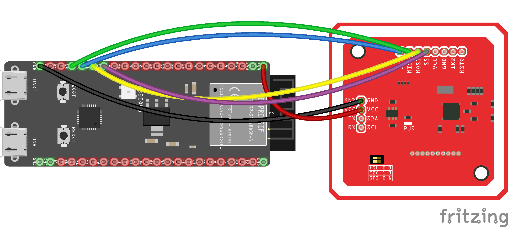
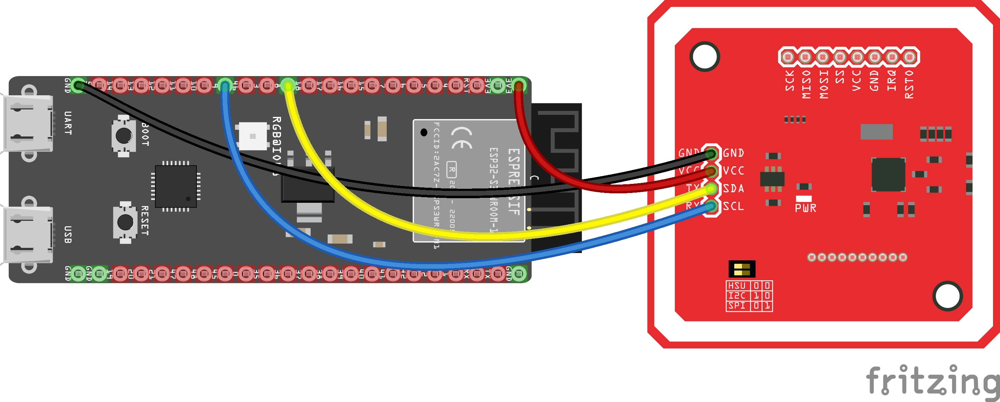

<div align="center">


### cryptnox-sdk-esp32

ESP32 SDK for managing Cryptnox smart card wallets

</div>

<br/>
<br/>

[](https://github.com/embarquech/cryptnox-sdk-esp32/actions/workflows/misra_check.yml)
[](https://www.espressif.com/en/products/socs)
[](https://docs.espressif.com/projects/esp-idf/en/v5.5/)
[](https://www.gnu.org/licenses/lgpl-3.0)

`cryptnox-sdk-esp32` is an ESP-IDF component bundle that enables the use of **Cryptnox Smart cards** on ESP32-family platforms.
It provides secure communication with the card, retrieves card information, and exposes basic cryptographic operations through the shared C++ core SDK.

---

## Supported hardware

### Cryptnox Hardware Wallet smart cards

Works with Cryptnox Hardware Wallet smart cards running firmware v1.6.0 or later.

| Smart card | Wallet version |
|------|---------------|
| [Crypto Hardware Wallet – Dual Card Set](https://shop.cryptnox.com/product/hardware-wallet-smartcard-dual/) | v1.6.1 |

### NFC readers

| Reader | Type | Interface |
|--------|------|-----------|
| [PN532 NFC Module](https://www.nxp.com/products/PN532) | Contactless (NFC/ISO 14443) | SPI or I²C |

### Host board

| Board | MCU | Notes |
|-------|-----|-------|
| [ESP32-S3-DevKitC-1](https://docs.espressif.com/projects/esp-idf/en/latest/esp32s3/hw-reference/esp32s3/user-guide-devkitc-1.html) | ESP32-S3-WROOM-1 | Official Espressif dev kit — wire PN532 with jumpers to the 2×22-pin headers |


---

## Installation

1. Install **ESP-IDF v5.5** following the [official guide](https://docs.espressif.com/projects/esp-idf/en/v5.5/esp32s3/get-started/index.html).
2. Clone this repository **with submodules** (the C++ core SDK is a submodule):
   ```bash
   git clone --recurse-submodules https://github.com/embarquech/cryptnox-sdk-esp32.git
   ```
3. From the project root, set the target and build:
   ```bash
   idf.py set-target esp32s3
   idf.py build flash monitor
   ```

## Hardware setup

> [!CAUTION]
> Always double-check the wiring before powering the board to prevent damage.

Wiring shown for the **ESP32-S3-DevKitC-1**.

### ESP32-S3 and PN532 NFC — SPI interface

| PN532 Pin | ESP32-S3 GPIO | Wire Color |
|-----------|---------------|------------|
| VCC       | 3.3V          | Red        |
| GND       | GND           | Black      |
| SCK       | IO12          | Blue       |
| MISO      | IO13          | Green      |
| MOSI      | IO11          | Yellow     |
| SS (CS)   | IO10          | Violet     |

> [!IMPORTANT]
> Make sure the switches on the PN532 module are configured for **SPI** mode:
>
> - **Switch 0** → HIGH
> - **Switch 1** → LOW




### ESP32-S3 and PN532 NFC — I²C interface

| PN532 Pin | ESP32-S3 GPIO | Wire Color |
|-----------|---------------|------------|
| VCC       | 3.3V          | Red        |
| GND       | GND           | Black      |
| SDA       | IO8           | Yellow     |
| SCL       | IO9           | Blue       |
| IRQ       | IO20          | Violet     |
| RST       | IO21          | Grey       |

> [!IMPORTANT]
> Make sure the switches on the PN532 module are configured for **I²C** mode:
>
> - **Switch 0** → LOW
> - **Switch 1** → HIGH



---

## Quick usage examples

All examples assume the shared SPI bus has been initialised and the three adapters
(`ESP32Logger`, `ESP32CryptoProvider`, `ESP32Pn532Transport`) are wired into a
`CryptnoxWallet`. Helper macros are used for brevity; see `examples/UsdcSigning/`
for the full ESP-IDF boilerplate.

### 1. Connect to a Cryptnox card

```cpp
#include "CryptnoxWallet.h"
#include "ESP32Logger.h"
#include "esp32_crypto_provider.h"
#include "esp32_pn532_transport.h"
#include "esp_log.h"

static const char *TAG = "main";

extern "C" void app_main(void) {
    ESP32Logger          logger;
    ESP32CryptoProvider  crypto;
    ESP32Pn532Transport  transport(SPI2_HOST, /*cs_gpio=*/10);
    CryptnoxWallet       wallet(transport, logger, crypto);

    if (!wallet.begin()) {
        ESP_LOGE(TAG, "Reader not found");
        return;
    }

    CW_SecureSession session;
    if (!wallet.connect(session)) {
        ESP_LOGE(TAG, "Card not detected or secure channel failed");
        return;
    }

    CW_CardInfo info = {};
    if (wallet.getCardInfo(session, info)) {
        ESP_LOGI(TAG, "Card serial number: %s", info.serialNumber);
    }

    wallet.disconnect(session);
}
```

### 2. Verify the PIN code

The card must be initialised before calling `verifyPin`.

> **Security note:** Never hard-code a PIN in firmware — read it from a secure source at runtime and wipe the buffer with `CW_Utils::secure_wipe()` immediately after use.

```cpp
extern "C" void app_main(void) {
    ESP32Logger          logger;
    ESP32CryptoProvider  crypto;
    ESP32Pn532Transport  transport(SPI2_HOST, /*cs_gpio=*/10);
    CryptnoxWallet       wallet(transport, logger, crypto);
    wallet.begin();

    CW_SecureSession session;
    if (!wallet.connect(session)) {
        ESP_LOGE(TAG, "Card not detected");
        return;
    }

    /* Read the PIN from a secure source — never hard-code it. */
    uint8_t pin[CW_MAX_PIN_LENGTH] = { 0U };
    uint8_t pinLength = 0U;
    read_pin_from_secure_input(pin, &pinLength);  /* implement for your platform */

    CW_PinResult res = wallet.verifyPin(session, pin, pinLength);
    CW_Utils::secure_wipe(pin, sizeof(pin));  /* wipe PIN immediately after use */
    switch (res) {
        case CW_PIN_OK:
            ESP_LOGI(TAG, "PIN verified — card is ready for signing");
            break;
        case CW_PIN_INVALID:
            ESP_LOGW(TAG, "Invalid PIN code");
            break;
        case CW_PIN_LENGTH_INVALID:
            ESP_LOGW(TAG, "Invalid PIN length or PIN authentication disabled");
            break;
        case CW_PIN_LOCKED:
            ESP_LOGW(TAG, "Card is locked — power-cycle the card");
            break;
    }

    wallet.disconnect(session);
}
```

### 3. Sign a transaction hash

Signs a 32-byte digest (e.g. SHA-256 of a Bitcoin or Ethereum transaction)
on the secp256k1 curve.

```cpp
extern "C" void app_main(void) {
    ESP32Logger          logger;
    ESP32CryptoProvider  crypto;
    ESP32Pn532Transport  transport(SPI2_HOST, /*cs_gpio=*/10);
    CryptnoxWallet       wallet(transport, logger, crypto);
    wallet.begin();

    CW_SecureSession session;
    if (!wallet.connect(session)) {
        ESP_LOGE(TAG, "Card not detected");
        return;
    }

    const uint8_t hash[32] = { /* SHA-256(your_tx) */ };
    CW_SignRequest req(session,
                       /*keyType=*/    CW_KEY_SECP256K1,
                       /*signatureType=*/CW_SIG_ECDSA,
                       /*pinLessMode=*/false);
    req.hash         = hash;
    req.hashLength   = sizeof(hash);
    /* Read the PIN from a secure source — never hard-code it in the firmware. */
    read_pin_from_secure_input(req.pin, NULL);  /* implement for your platform */

    CW_SignResult sig = wallet.sign(req);
    if (sig.errorCode == CW_SIGN_OK) {
        ESP_LOGI(TAG, "Signature OK (64-byte r||s in sig.signature)");
        // Forward sig.signature to your blockchain client...
    } else {
        ESP_LOGE(TAG, "Sign failed: 0x%02X", sig.errorCode);
    }

    wallet.disconnect(session);
}
```

See `examples/UsdcSigning/` for a full reference that wires up the SPI bus and polls the PN532.

---

## Security

- **Flash Encryption and Secure Boot V2** must be enabled for production deployments. Defaults are set in `sdkconfig.defaults`. eFuse programming is irreversible — practice on a development board first.
- **Hard-coded secrets:** Never hard-code a PIN or private key in firmware. Wipe PIN buffers with `CW_Utils::secure_wipe()` immediately after use.
- **Dependency pinning:** Use the exact ESP-IDF tag (`v5.5.0`) and pin the `cryptnox-sdk-cpp` submodule to a commit hash.

---

## Documentation

The generated documentation for this project is available [here](https://embarquech.github.io/cryptnox-sdk-esp32/).

## License

`cryptnox-sdk-esp32` is dual-licensed:

- **LGPL-3.0** for open-source projects and proprietary projects that comply with LGPL requirements  
- **Commercial license** for projects that require a proprietary license without LGPL obligations (see COMMERCIAL.md for details)

For commercial inquiries, contact: contact@cryptnox.com
